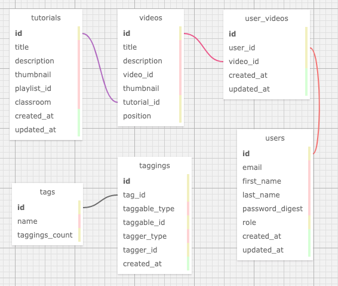

# Brownfield Of Dreams

**Learning Goals**

Working within an  already established code base to implement the following:
  * Integrate Github Oauth to verify a user's identity and consume Github's API
    to display a user's github repos, followers and following users.
  * Establish a self referential relationship in the User model to friend other
    users within the database.
  * Use email verification to activate an account.
  * Use email to invite friends with a Github account to register for an account
    with our app.

### About the Project

This is a Ruby on Rails application used to organize YouTube content used for online learning. Each tutorial is a playlist of video segments. Within the application an admin is able to create tags for each tutorial in the database. A visitor or registered user can then filter tutorials based on these tags.

A visitor is able to see all of the content on the application but in order to bookmark a segment they will need to register. Once registered a user can bookmark any of the segments in a tutorial page.

## Local Setup

First you'll need to setup an API key with YouTube and have it defined within ENV['YOUTUBE_API_KEY']. Using the developer settings in github register your app with github for a clientid and secret for Oauth access: ENV['GITHUB_CLIENT_ID'], ENV['GITHUB_CLIENT_SECRET']

Clone down the repo
```
$ git clone
```

Install the gem packages
```
$ bundle install
```

Install node packages for stimulus
```
$ brew install node
$ brew install yarn
$ yarn add stimulus
```

Set up the database
```
$ rake db:create
$ rake db:migrate
$ rake db:seed
```

Run the test suite:
```ruby
$ bundle exec rspec
```

## Database


## Technologies
* [Stimulus](https://github.com/stimulusjs/stimulus)
* [will_paginate](https://github.com/mislav/will_paginate)
* [acts-as-taggable-on](https://github.com/mbleigh/acts-as-taggable-on)
* [webpacker](https://github.com/rails/webpacker)
* [vcr](https://github.com/vcr/vcr)
* [selenium-webdriver](https://www.seleniumhq.org/docs/03_webdriver.jsp)
* [chromedriver-helper](http://chromedriver.chromium.org/)

### Versions
* Ruby 2.4.1
* Rails 5.2.0
